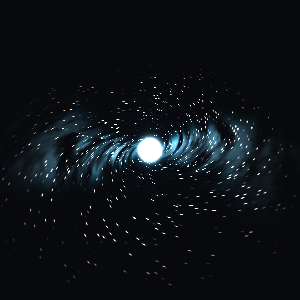
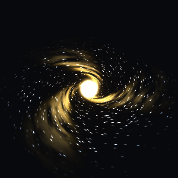
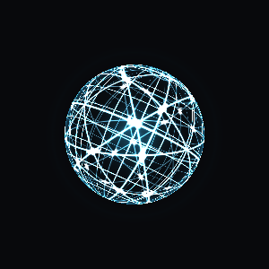
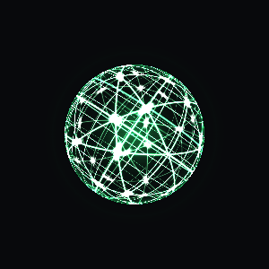
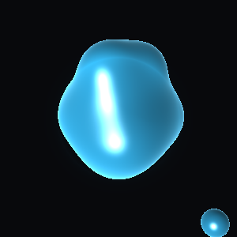
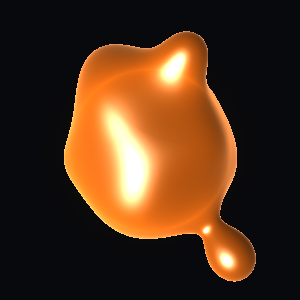
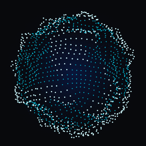
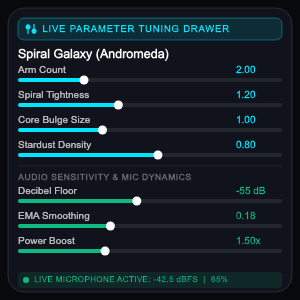
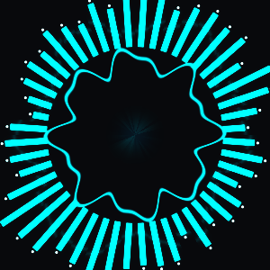
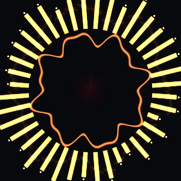

<div align="center">

# 🔮 Flutter Orb (`flutter_orb`)

**High-performance, audio-reactive 3D particle voice orbs, liquid metaballs, galaxies, wireframes & spectrum visualizers in Flutter**  
*Powered by Impeller-compatible GLSL runtime shaders & real-time microphone stream.*

<br />

[](https://flutter-orb.web.app/)
[](https://pub.dev/packages/flutter_orb)
[](https://github.com/Jerinji2016/flutter-orb/actions/workflows/ci.yml)
[](https://github.com/Jerinji2016/flutter-orb/actions/workflows/deploy_web.yml)
[](https://codecov.io/gh/Jerinji2016/flutter-orb)
[](LICENSE)

<br />

👉 **[Launch Interactive Web Demo →](https://flutter-orb.web.app/)** 👈

</div>

---

## 📸 Visual Showcase

<div align="center">

### 🪐 Spiral Galaxies & Holographic Wireframes
| Andromeda Core (`GalaxyOrb`) | Supernova Blast (`GalaxyOrb`) | Hologram HUD (`WireframeOrb`) | Matrix Lattice (`WireframeOrb`) |
| :---: | :---: | :---: | :---: |
|  |  |  |  |

### 💧 Liquid Metaballs & 3D Wave Particle Spheres
| Mercury Chrome (`LiquidOrb`) | Magma Lava (`LiquidOrb`) | Gemini Aura (`ParticleOrb`) | Live Parameter Tuner |
| :---: | :---: | :---: | :---: |
|  |  |  |  |

### 📊 Radial Audio Spectrum Equalizers
| Neon Equalizer (`SpectrumOrb`) | Sunset Echo (`SpectrumOrb`) |
| :---: | :---: |
|  |  |

</div>

---

## ✨ Features

- ⚡ **5 Dedicated GPU Visualizer Widgets**:
  - `ParticleOrb`: Procedural 3D wave particle sphere with surface noise waves (`shaders/orb.frag`).
  - `LiquidOrb`: Raymarched Signed Distance Field (SDF) metaballs & gooey fluid blob with Blinn-Phong specular highlights and subsurface scattering (`shaders/liquid_orb.frag`).
  - `GalaxyOrb`: Volumetric spiral disk particle system with differential Keplerian rotation and galactic core flares (`shaders/galaxy_orb.frag`).
  - `WireframeOrb`: Holographic rotating geodesic lattice with glowing vertex nodes and CRT scanlines (`shaders/wireframe_orb.frag`).
  - `SpectrumOrb`: Radial frequency equalizer bars and concentric oscillating waveform ribbons (`shaders/audio_spectrum.frag`).
- 🎙️ **Live Audio Reactive**: Seamlessly streams decibel amplitude from the microphone via `record` and maps to GPU uniforms in real-time.
- 🌊 **Liquid-Smooth Dynamics**: Built-in Exponential Moving Average (EMA) audio smoothing, configurable noise floors, peak ceilings, and non-linear power curves.
- 🎨 **Type-Safe Specialized Styles & Presets**: Dedicated style models (`ParticleOrbStyle`, `LiquidOrbStyle`, `GalaxyOrbStyle`, `WireframeOrbStyle`, `SpectrumOrbStyle`) with rich presets for each visualizer.
- 📱 **All-in-One & Standalone Modes**:
  - `AudioReactiveOrb`: Drop-in widget with automatic mic capture, lifecycle handling, permissions, and named constructors (`.particle()`, `.liquid()`, `.galaxy()`, `.wireframe()`, `.spectrum()`).
- 🧪 **Offline / Simulator Mode**: Built-in conversational speech, pulse, and sinusoidal wave simulation when microphone is unavailable.

---

## 🚀 Getting Started

### 1. Add Dependency

Add `flutter_orb` to your `pubspec.yaml`:

```yaml
dependencies:
  flutter_orb: ^1.1.0
```

### 2. Platform Permissions

#### Android (`android/app/src/main/AndroidManifest.xml`)
```xml
<uses-permission android:name="android.permission.RECORD_AUDIO" />
```

#### iOS (`ios/Runner/Info.plist`)
```xml
<key>NSMicrophoneUsageDescription</key>
<string>Microphone access is needed for the voice orb visualizer.</string>
```

#### macOS (`macos/Runner/Info.plist` & Entitlements)
In `Info.plist`:
```xml
<key>NSMicrophoneUsageDescription</key>
<string>Microphone access is needed for the voice orb visualizer.</string>
```
In `macos/Runner/DebugProfile.entitlements` and `Release.entitlements`:
```xml
<key>com.apple.security.device.audio-input</key>
<true/>
```

---

## 🛠️ Usage Examples

### 1. Drop-In Audio Reactive Orbs

Drop-in microphone visualizers with automatic capture, smoothing, and permission handling:

```dart
// 1. Particle Sphere
AudioReactiveOrb.particle(
  style: ParticleOrbStyle.gemini(),
  width: 300,
  height: 300,
)

// 2. Raymarched Liquid Metaballs
AudioReactiveOrb.liquid(
  style: LiquidOrbStyle.mercury(),
  width: 300,
  height: 300,
)

// 3. Spiral Galaxy Core
AudioReactiveOrb.galaxy(
  style: GalaxyOrbStyle.andromeda(),
  width: 300,
  height: 300,
)

// 4. Holographic Geodesic Wireframe
AudioReactiveOrb.wireframe(
  style: WireframeOrbStyle.hologram(),
  width: 300,
  height: 300,
)

// 5. Radial Audio Spectrum Equalizer
AudioReactiveOrb.spectrum(
  style: SpectrumOrbStyle.neonEqualizer(),
  width: 300,
  height: 300,
)
```

---

### 2. Standalone Visualizer Widgets

Feed custom audio energy `[0.0 - 1.0]` (from a player, TTS, speech synthesizer, or animation):

```dart
// Liquid Orb
LiquidOrb(
  audioEnergy: 0.75,
  style: LiquidOrbStyle.lava(),
  width: 250,
  height: 250,
)

// Galaxy Orb
GalaxyOrb(
  energyListenable: myEnergyNotifier,
  style: GalaxyOrbStyle.supernova(),
)

// Wireframe Orb
WireframeOrb(
  energyListenable: myVoiceController,
  style: WireframeOrbStyle.matrix(),
)

// Spectrum Orb
SpectrumOrb(
  energyListenable: myVoiceController,
  style: SpectrumOrbStyle.sunsetEcho(),
)
```

---

### 3. Custom Controller & Audio Tuning

Customize sensitivity, decibel floors, smoothing responsiveness, or switch between live mic and simulation:

```dart
final controller = VoiceOrbController(
  minDb: -55.0, // Noise floor threshold
  maxDb: -5.0,  // Peak loudness threshold
  smoothingFactor: 0.18, // Attack/decay responsiveness
  powerBoost: 1.5, // Non-linear response curve
);

// Start live microphone capture
await controller.start();

// Or enable simulated speech cadence for emulators or testing
controller.setSimulated(true, mode: SimulationMode.speech);
```

---

### 4. Specialized Style Presets

Each widget has its own strongly-typed configuration model with tailored presets:

#### Particle Presets (`ParticleOrbStyle` / `OrbStyle`)
- `ParticleOrbStyle.gemini()` — Google Gemini Cyan & Electric Blue
- `ParticleOrbStyle.cyberpunk()` — Neon Magenta & Electric Teal
- `ParticleOrbStyle.solar()` — Solar Flare Crimson & Radiant Gold
- `ParticleOrbStyle.emerald()` — Emerald Deep Teal & Mint
- `ParticleOrbStyle.neonRose()` — Royal Purple & Hot Pink
- `ParticleOrbStyle.monochrome()` — Slate & Radiant White

#### Liquid Presets (`LiquidOrbStyle`)
- `LiquidOrbStyle.mercury()` — Molten chrome/silver with electric blue rim glow
- `LiquidOrbStyle.lava()` — Obsidian core with glowing magma orange crests
- `LiquidOrbStyle.plasma()` — Deep violet to hot neon pink fluid
- `LiquidOrbStyle.toxicSlime()` — Radioactive dark emerald & vibrant lime
- `LiquidOrbStyle.amethyst()` — Deep indigo & radiant purple

#### Galaxy Presets (`GalaxyOrbStyle`)
- `GalaxyOrbStyle.andromeda()` — Cosmic deep navy with starlight cyan spiral arms
- `GalaxyOrbStyle.supernova()` — Crimson core with incandescent golden ejecta
- `GalaxyOrbStyle.milkyWay()` — Warm amber nucleus with violet spiral arms
- `GalaxyOrbStyle.blackHole()` — Dark singularity surrounded by accretion disk
- `GalaxyOrbStyle.nebula()` — Deep oceanic teal with emerald stellar dust

#### Wireframe Presets (`WireframeOrbStyle`)
- `WireframeOrbStyle.hologram()` — Sci-fi cyan & pure white holographic HUD
- `WireframeOrbStyle.matrix()` — Terminal black with luminous green matrix nodes
- `WireframeOrbStyle.cyberLattice()` — Synthwave magenta with cyan vertices
- `WireframeOrbStyle.goldenCortex()` — Warm amber neural lattice in 24k gold
- `WireframeOrbStyle.stealthRed()` — Carbon charcoal with sharp laser crimson

#### Spectrum Presets (`SpectrumOrbStyle`)
- `SpectrumOrbStyle.neonEqualizer()` — Deep blue to electric cyan equalizer bars
- `SpectrumOrbStyle.sunsetEcho()` — Royal purple to radiant sunset amber ribbons
- `SpectrumOrbStyle.vaporwave()` — Retro pastel violet & mint turquoise
- `SpectrumOrbStyle.radiantGreen()` — Emerald core with lime frequency bars
- `SpectrumOrbStyle.monochrome()` — Minimal dark slate & pure white illuminated caps

---

## 📄 License

MIT License. See [LICENSE](LICENSE) for details.
