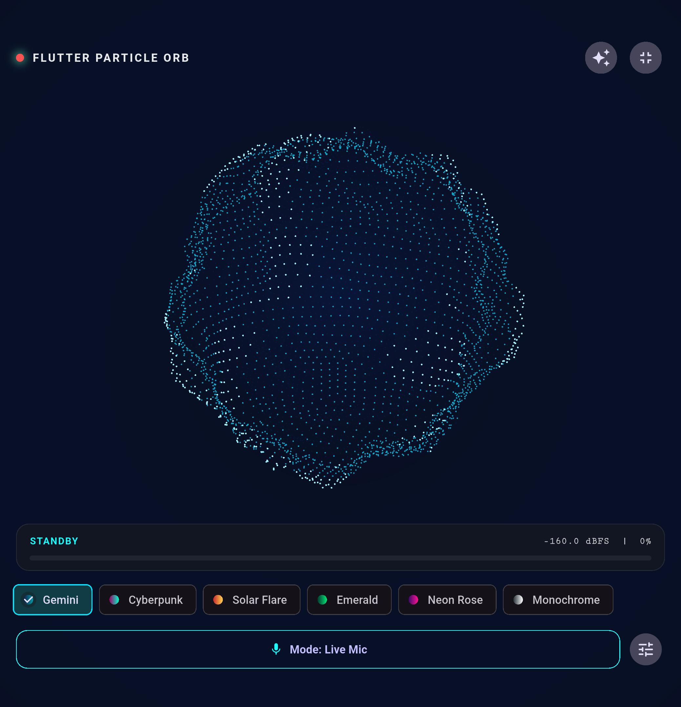
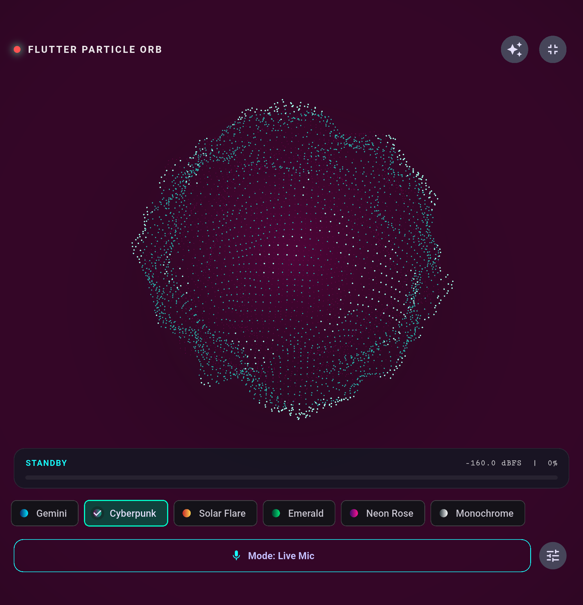
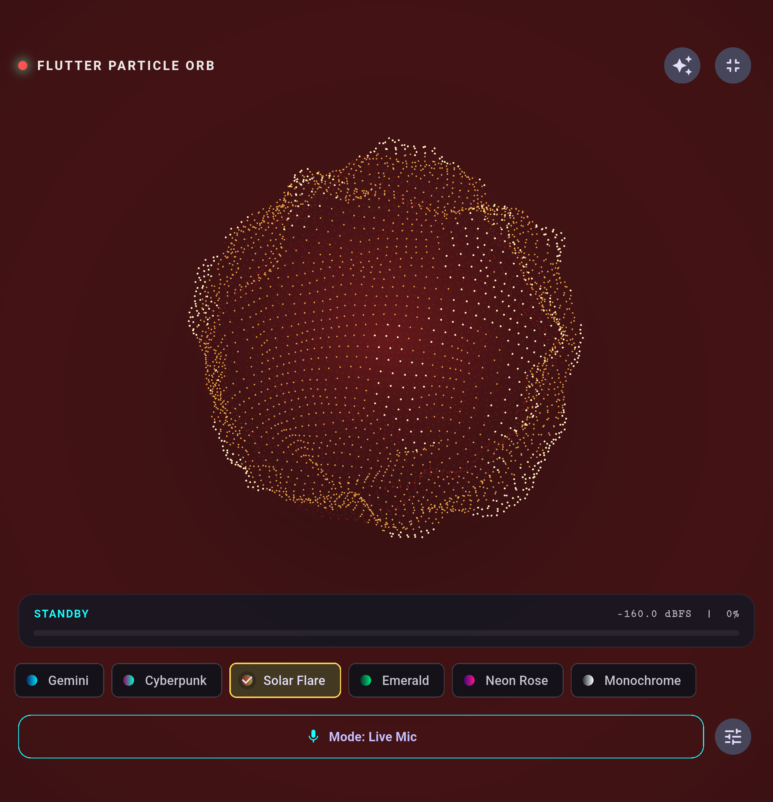
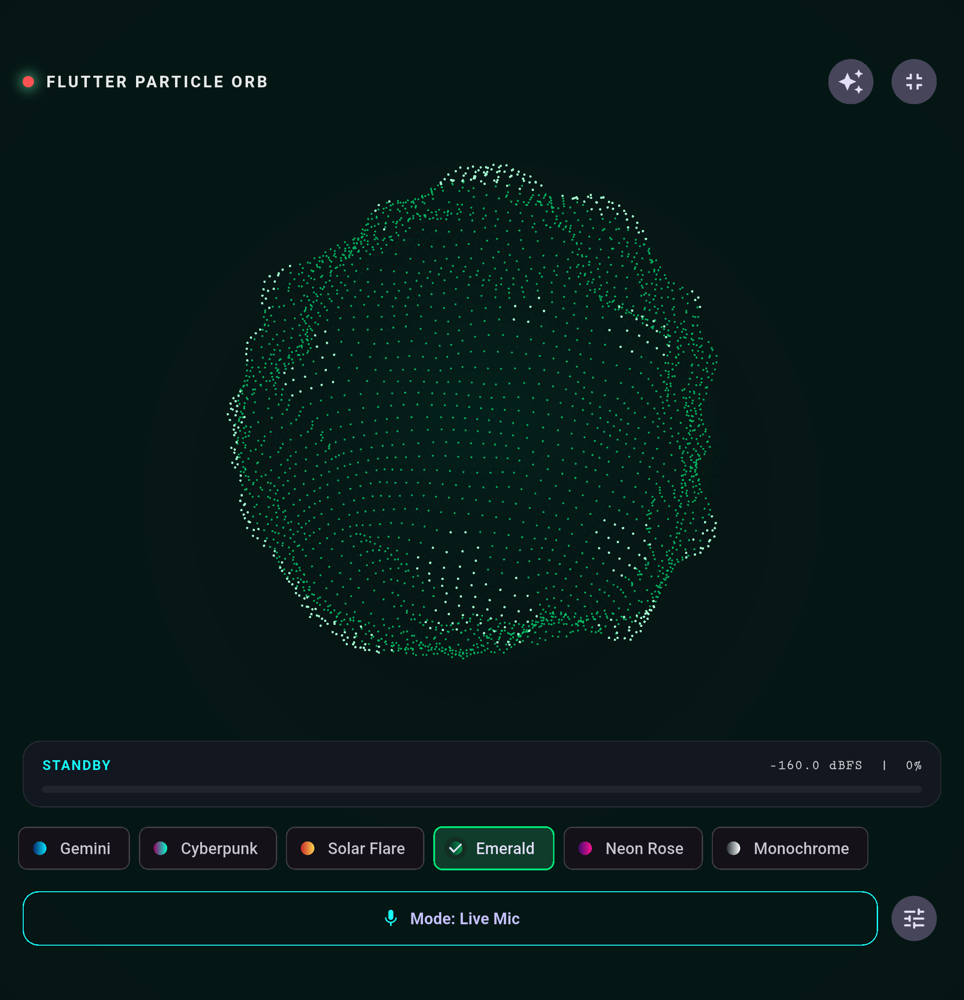
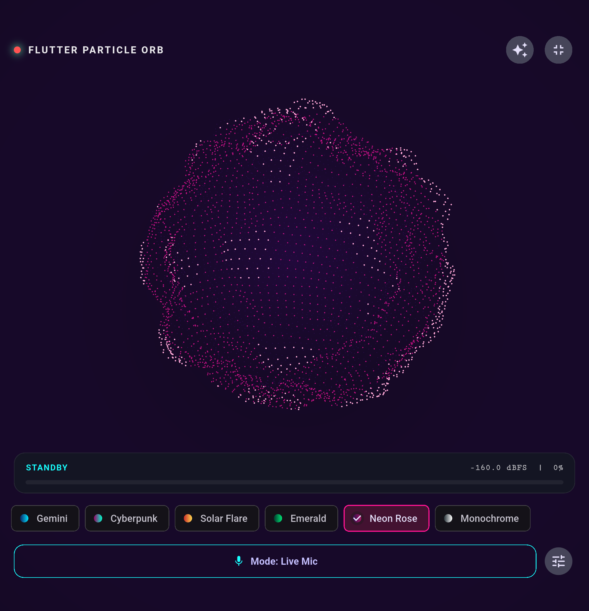
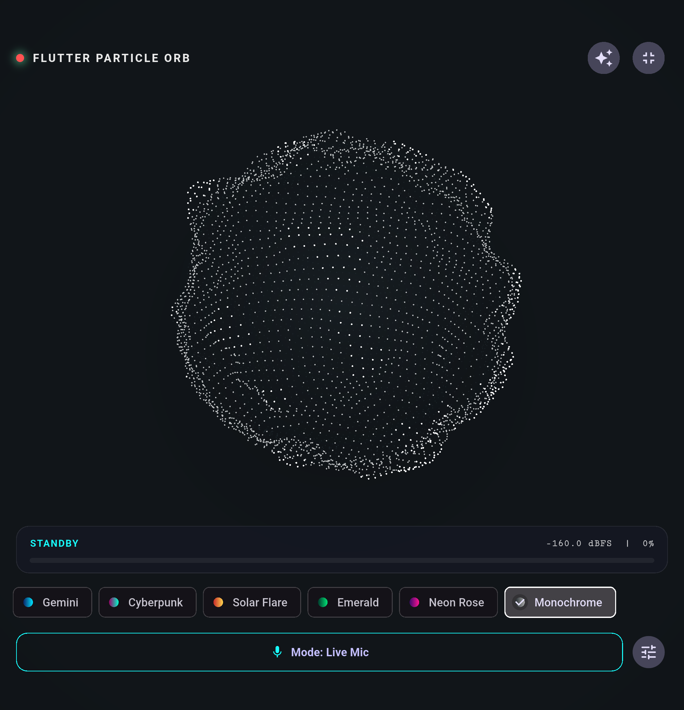
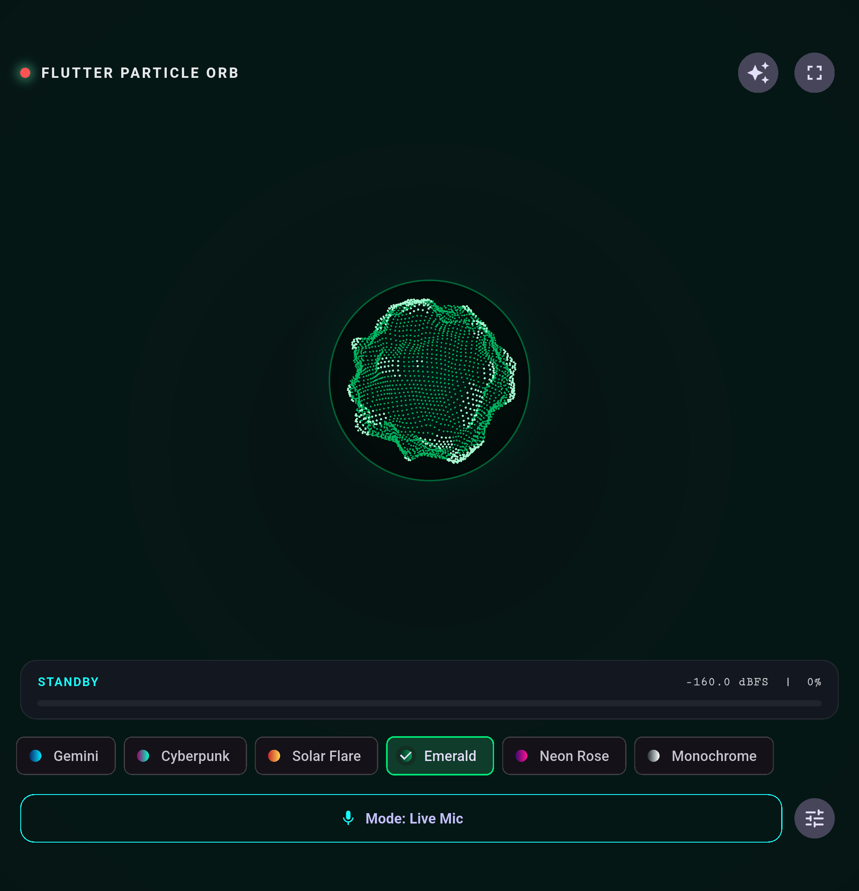
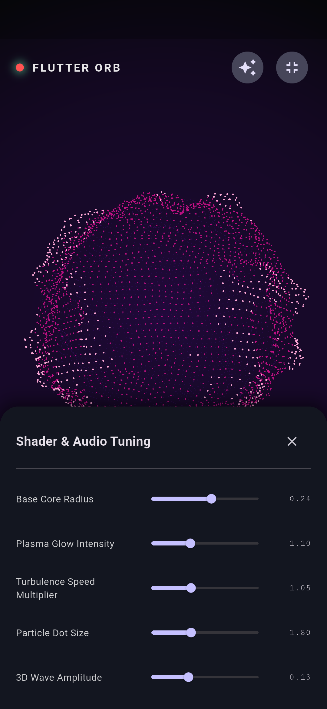

<div align="center">

# 🔮 Flutter Orb (`flutter_orb`)

**High-performance, audio-reactive 3D particle voice orb visualizer in Flutter**  
*Powered by Impeller-compatible GLSL runtime shaders & real-time microphone stream.*

<br />

[](https://flutter-orb.web.app/)
[](https://pub.dev/packages/flutter_orb)
[](https://github.com/Jerinji2016/flutter-orb/actions/workflows/ci.yml)
[](https://github.com/Jerinji2016/flutter-orb/actions/workflows/deploy_web.yml)
[](https://codecov.io/gh/Jerinji2016/flutter-orb)
[](LICENSE)

<br />

👉 **[Launch Interactive Web Demo →](https://flutter-orb.web.app/)** 👈

</div>

---

## ✨ Features

- ⚡ **GPU Accelerated**: Raymarched 3D Simplex noise particle field rendered directly via Flutter's `FragmentProgram` / `FragmentShader` API (compatible with Impeller & Skia).
- 🎙️ **Live Audio Reactive**: Seamlessly streams decibel amplitude from the microphone via `record` package and maps to GPU uniforms in real-time.
- 🌊 **Liquid-Smooth Dynamics**: Built-in Exponential Moving Average (EMA) audio smoothing, configurable noise floors, peak ceilings, and non-linear power curves.
- 🎨 **Fully Customizable & Presets**: Includes built-in themes (*Gemini*, *Cyberpunk*, *Solar Flare*, *Emerald Deep*, *Neon Rose*, *Monochrome*) or provide custom silent/active colors, glow, radius, and speed.
- 📱 **All-in-One & Standalone Modes**:
  - `AudioReactiveOrb`: Drop-in widget with automatic mic capture, lifecycle handling, and permissions.
  - `ParticleOrb`: Pure visualizer widget driven by any audio energy stream (mic, TTS, music, speech synthesizer, or simulated animation).
- 🧪 **Offline / Simulator Mode**: Built-in speech cadence and pulse simulation when microphone is unavailable.

---

## 📸 Visual Showcase

### Built-in 3D Particle Sphere Themes (100% Consistent Fullscreen View)

| Google Gemini Aura | Cyberpunk Electric Pulse | Solar Flare Dynamics |
| :---: | :---: | :---: |
|  |  |  |

| Emerald Deep Mint | Neon Rose Hot Pink | Monochrome Minimalist |
| :---: | :---: | :---: |
|  |  |  |

### UI Features & Customization Modes

| Compact Voice Assistant Bubble | Live Shader & Audio Tuning Panel |
| :---: | :---: |
|  |  |

---

## 🚀 Getting Started

### 1. Add Dependency

Add `flutter_orb` to your `pubspec.yaml`:

```yaml
dependencies:
  flutter_orb: ^1.0.0
```

### 2. Platform Permissions

#### Android (`android/app/src/main/AndroidManifest.xml`)
```xml
<uses-permission android:name="android.permission.RECORD_AUDIO" />
```

#### iOS (`ios/Runner/Info.plist`)
```xml
<key>NSMicrophoneUsageDescription</key>
<string>Microphone access is needed for the voice orb visualizer.</string>
```

#### macOS (`macos/Runner/Info.plist` & Entitlements)
In `Info.plist`:
```xml
<key>NSMicrophoneUsageDescription</key>
<string>Microphone access is needed for the voice orb visualizer.</string>
```
In `macos/Runner/DebugProfile.entitlements` and `Release.entitlements`:
```xml
<key>com.apple.security.device.audio-input</key>
<true/>
```

---

## 🛠️ Usage Examples

### 1. Drop-In Audio Reactive Orb

The easiest way to display an audio-reactive voice orb:

```dart
import 'package:flutter/material.dart';
import 'package:flutter_orb/flutter_orb.dart';

class VoiceAssistantScreen extends StatelessWidget {
  const VoiceAssistantScreen({super.key});

  @override
  Widget build(BuildContext context) {
    return Scaffold(
      backgroundColor: Colors.black,
      body: Center(
        child: AudioReactiveOrb(
          style: OrbStyle.gemini(),
          width: 300,
          height: 300,
        ),
      ),
    );
  }
}
```

---

### 2. Pure Visualizer Widget (`ParticleOrb`)

If you want to feed custom audio values (e.g. from an audio player, TTS engine, or animation controller):

```dart
ParticleOrb(
  audioEnergy: 0.75, // 0.0 (silent) to 1.0 (loud)
  style: OrbStyle.cyberpunk(),
  width: 250,
  height: 250,
)
```

Or pass a `ValueListenable<double>`:

```dart
ParticleOrb(
  energyListenable: myEnergyNotifier,
  style: OrbStyle.solar(),
)
```

---

### 3. Custom Controller & Audio Tuning

Customize sensitivity, decibel ranges, smoothing responsiveness, or switch between live mic and simulated voice modes:

```dart
final controller = VoiceOrbController(
  minDb: -50.0, // Noise floor threshold
  maxDb: -10.0, // Peak loudness threshold
  smoothingFactor: 0.20, // Attack/decay responsiveness
  powerBoost: 1.6, // Exponential curve for punchy reactivity
);

// Start live microphone capture
await controller.start();

// Or enable simulated speech cadence for emulators or testing
controller.setSimulated(true, mode: SimulationMode.speech);
```

---
 
 ### 4. Custom Styling & Presets
 
 ```dart
 // Custom Style
 final customStyle = OrbStyle(
   silentColor: const Color(0xFF1E3A8A), // Deep Blue
   activeColor: const Color(0xFFF59E0B), // Vibrant Amber
   baseRadius: 0.24,
   glowIntensity: 1.3,
   speedMultiplier: 1.2,
   idleTurbulence: 0.0, // 0.0 for a perfect sphere, 0.2 for subtle breathing
 );
 
 // Built-in Presets
 OrbStyle.gemini()      // Google Gemini Violet / Cyan
 OrbStyle.cyberpunk()   // Magenta / Neon Lime
 OrbStyle.solar()       // Crimson / Gold
 OrbStyle.emerald()     // Forest Teal / Vivid Mint
 OrbStyle.neonRose()    // Royal Purple / Hot Pink
 OrbStyle.monochrome()  // Slate / Radiant White
 ```
 
 ---
 
 ## 📸 In-App Screenshot Automation
 
 Generate and update all visual documentation screenshots natively through Flutter using `package:integration_test` and `flutter drive`:
 
 ```bash
 cd example
 flutter drive \
   --driver=test_driver/integration_test.dart \
   --target=integration_test/screenshot_test.dart
 ```
 
 Screenshots are automatically captured in real-time with 60 FPS live particle simulations and saved directly to `example/doc/screenshots/`.
 
 ---
 
 ## 📄 License
 
 MIT License. See [LICENSE](LICENSE) for details.
